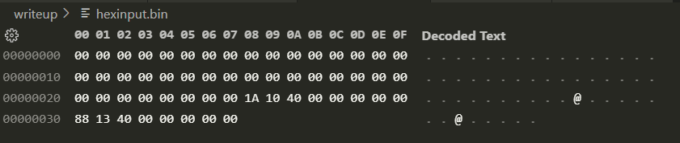

# Writeup

Like overflow1 [vuln.c](../src/vuln.c) uses `gets()`, but the normal execution flow will in no obvious way make the program output the flag.
The clues are in the functions `win()` and `print_flag()` and our objective is to perform a stack overflow with such a specific value that the program will unintentionally execute either of those functions.

## C Functions and the Stack

When you call a function `f()` in C there are two very specific things that happen.
1. Immediately before jumping to `f()` the calling function will store the **Instruction Pointer** (IP) on the stack.
2. Later, the called function will execute return-instruction `ret` which reads the stored IP from the stack and puts it into **Instruction Pointer Register** (RIP).
This is how a process know exactly where to jump back into a previous function.
We are going to overwrite the IP stack value which is written by the function who called `main()`, and cause the `return 0;` line to jump to our desired function.

### How

Firstly, we have access to the source code so we can compile and find the address for either `win()` or `print_flag()`.
Secondly, we need to know the place to put our target address.
Since the buffer `name` is 32-bytes long and the compiler will add 8 bytes of padding after that, we should expect the IP to be written 40-bytes above the buffer `name+40`.

Some 64-bit instructions require the stack pointer to be 16-byte aligned, i.e. ending with address `0x...0`.
This is problematic for us because writing an 8-byte address into `name+40` makes the stack unaligned, i.e. ending with address `0x...8`.
The solution is to write the target address into `name+48` and the address for *any return instruction* in the executable into `name+40`.
The following will happen:
1. The `return 0;` in `main()` will jump to that `ret` IP and execute another return on top of `return 0;`.
2. The 2nd `ret` instruction will correct the stack address into ending with `0x...0`.
3. Additionally, the 2nd `ret` instruction will take the next stack value into the RIP which will be our target address for either `win()` or `print_flag()`.

The following is an image of the hexadecimal byte dump (little endian byte order) of one file that will work with `./vuln < hexinput.bin`:

> See [solve.sh](./solve.sh) for a complete solution on how to do the above mentioned steps.
> Like before, there are stack visualizations.

Performing `./solve.sh 40` should reveal the flag:
> TD{1ns7ructi0n_p01nt3r_0v3rfl0w}
